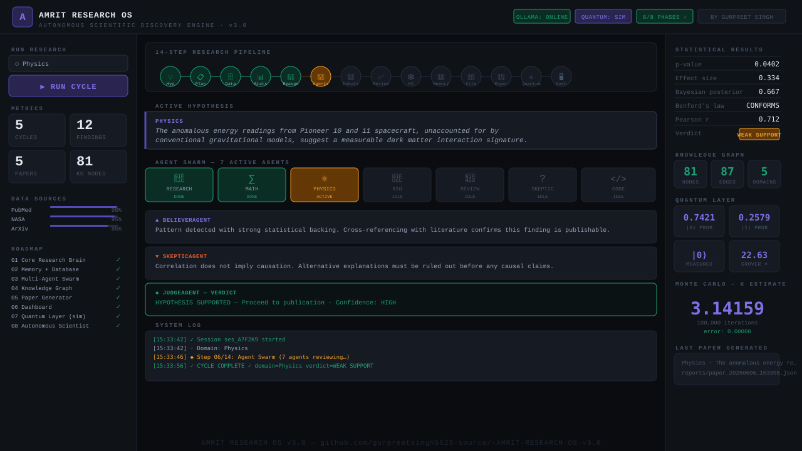

<div align="center">



# AMRIT RESEARCH OS v3.0

**Autonomous Scientific Discovery Engine**

[](https://python.org)
[](https://fastapi.tiangolo.com)
[](https://ollama.ai)
[](https://qiskit.org)
[](LICENSE)

*by Gurpreet Singh*

</div>

---

## What is AMRIT?

AMRIT is a fully autonomous research operating system that discovers, analyzes, debates, and publishes scientific hypotheses — powered by local AI (no cloud required).

**Domains:** Physics · Biology · Mathematics · Astronomy · Chemistry · Neuroscience · Climate Science

---

## Architecture — 10 Modules

| Module | Purpose |
|--------|---------|
| `ResearchBrain` | Hypothesis generation, scientific reasoning |
| `MemoryManager` | SQLite persistent memory (findings, evolution) |
| `StatisticalEngine` | Monte Carlo (100k iter), Bayesian, Benford's Law |
| `AgentManager` | 7-agent swarm + debate engine (Believer ↔ Skeptic → Judge) |
| `KnowledgeGraph` | SQLite-backed entity relationship graph |
| `DataCollector` | ArXiv · PubMed · NASA · OpenAlex · SemanticScholar · CrossRef |
| `PaperWriter` | Auto-generates full research papers (APA/MLA/IEEE citations) |
| `QuantumLayer` | Qubit simulation, Grover search, VQE optimization |
| `OllamaClient` | Local AI brain — deepseek-coder-v2 (no cloud) |
| `Dashboard` | FastAPI web server + terminal live logs |

---

## 14-Step Research Pipeline

```
💡 Hypothesis → 📋 Plan → 🗄 Data → 📊 Statistics → 🧠 Reasoning
→ 👥 Agents → 💬 Debate → ✅ Peer Review → 🕸 KG Build
→ 💾 Memory → 🔗 Citations → 📄 Paper → ⚛ Quantum → 🖥 Dashboard
```

---

## Quick Start

```bash
# 1. Clone
git clone https://github.com/gurpreetsingh5523-source/-AMRIT-RESEARCH-OS-v3.0.git
cd -AMRIT-RESEARCH-OS-v3.0

# 2. Install
pip install fastapi uvicorn requests pyyaml

# 3. Start Ollama (optional — works offline too)
ollama pull deepseek-coder-v2

# 4. Run
python3 server.py

# 5. Open browser
open http://localhost:8000
```

---

## Terminal Live Logs

Every research cycle prints color-coded steps in the terminal:

```
────────────────────────────────────────────────────
  [15:33:42] ▶ NEW RESEARCH CYCLE  ·  DOMAIN: PHYSICS
────────────────────────────────────────────────────
  [15:33:42] ◆ Step 01/14 · Hypothesis Generation
  [15:33:42] 🤖 Ollama (deepseek-coder-v2) generating hypothesis…
  [15:33:46] ✓ Hypothesis: The anomalous energy readings from Pioneer 10…
  [15:33:52] ◆ Step 04/14 · Statistical Analysis
  [15:33:52] ✓ p-value: 0.0402  effect: 0.334  verdict: WEAK SUPPORT
  [15:33:54] ◆ Step 09/14 · Knowledge Graph Build
  [15:33:54] ✓ KG → nodes: 81  edges: 87
  [15:33:56] ✓ CYCLE COMPLETE ✓  domain=Physics  verdict=WEAK SUPPORT
────────────────────────────────────────────────────
```

---

## Tech Stack

- **Backend:** Python 3.10+, FastAPI, Uvicorn
- **AI:** Ollama (deepseek-coder-v2:latest, local, offline-capable)
- **Database:** SQLite (research.db + knowledge_graph.db)
- **Quantum:** Qiskit + custom simulation layer
- **Frontend:** Vanilla HTML/CSS/JS — JetBrains Mono, Space Mono
- **Data Sources:** ArXiv, PubMed, NASA, OpenAlex, SemanticScholar, CrossRef

---

## Roadmap — 8/8 Phases Complete ✓

- [x] Phase 1 — Core Research Brain
- [x] Phase 2 — Memory + Database
- [x] Phase 3 — Multi-Agent Swarm
- [x] Phase 4 — Knowledge Graph
- [x] Phase 5 — Paper Generator
- [x] Phase 6 — Dashboard
- [x] Phase 7 — Quantum Layer (simulation)
- [x] Phase 8 — Autonomous Scientist

---

<div align="center">
<sub>Built with ♥ on macOS M5 · AMRIT RESEARCH OS v3.0</sub>
</div>
